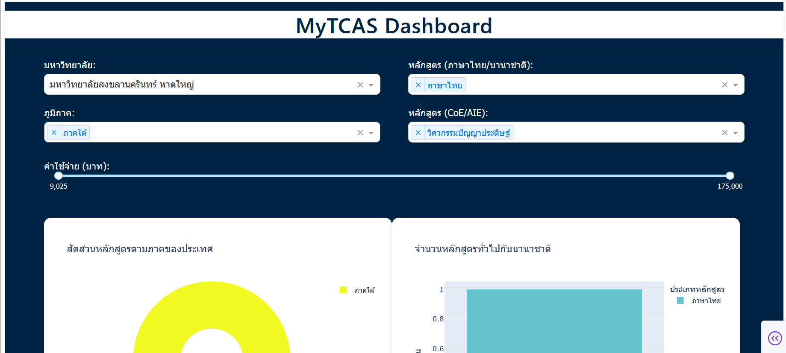
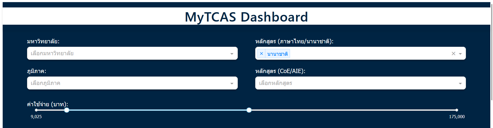
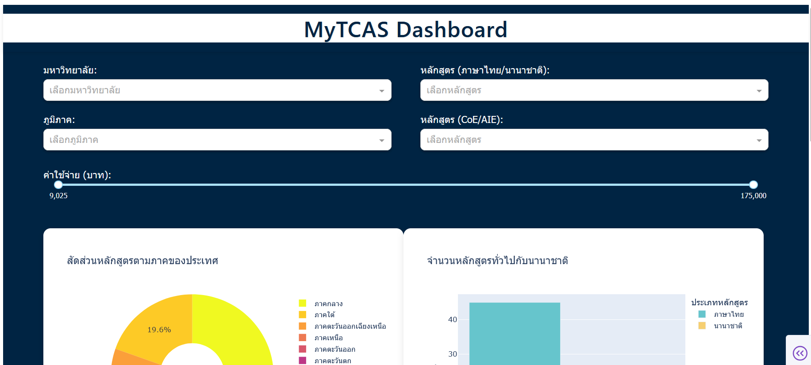
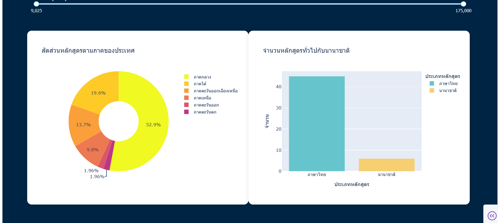
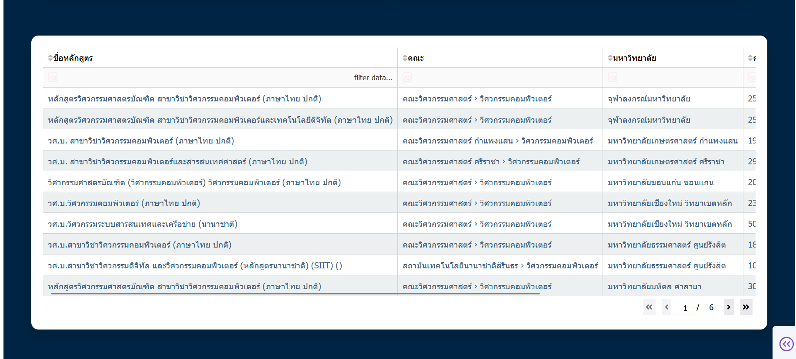

# MyTCAS Dashboard

**By 6510110311 พัทธดนย์ หนุดทอง**

## Project Overview

MyTCAS Dashboard is a professional web application for visualizing and comparing tuition fees of Computer Engineering and Artificial Intelligence Engineering programs in Thailand. The dashboard leverages data scraped from the official MyTCAS website and provides interactive filtering by region, university, program, and fee range. The project is designed for students, parents, and educators to make informed decisions based on comprehensive, up-to-date data.

## Key Features

- Interactive dashboard built with Dash and Plotly
- Filter by university, region, program type, and tuition fee range
- Visualizations: Pie chart by region, bar chart by program type
- Search and sort data in a dynamic table
- Modern, responsive UI with professional styling

## Installation & Usage

1. Install Python and pip
2. Install required dependencies:
   ```bash
   pip install dash pandas plotly openpyxl
   ```
3. Run the dashboard:
   ```bash
   python mytcas_dash.py
   ```
4. Open your browser at [http://127.0.0.1:8050](http://127.0.0.1:8050)

## File Structure & Details

- `mytcas_dash.py` : Main dashboard application. Loads and visualizes data, provides all interactive features and professional UI.
- `coe_and_aie_with_major.xlsx` : Cleaned and structured dataset containing program names, universities, regions, and tuition fees. Used as the data source for the dashboard.
- `tcas1.ipynb` : Jupyter notebook for scraping and cleaning data from MyTCAS. Includes Selenium-based scripts for automated data collection and preprocessing.
- `image/README/` : Example screenshots of the dashboard and its features.

## Example Usage

**Filter by university, region, program, and fee range:**


**Filter by tuition fee range:**


## Dashboard 





## Credits & Data Source

- Tuition fee and program data sourced from [MyTCAS](https://mytcas.com/)

## License

This project is for educational and non-commercial use only.
